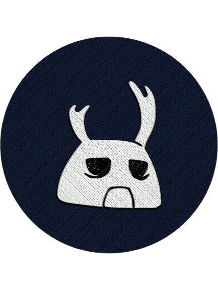
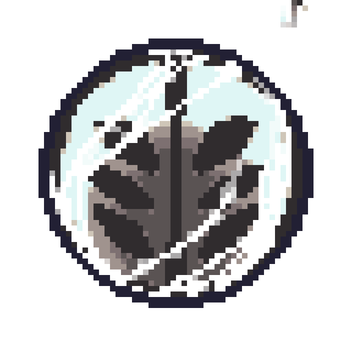

<h1 align="center">
   
  Hi, I'm Rizal Akbar Syah Fauzan Putra
</h1>
<h3 align="center">A Wanderer's Profile</h3>

   
  Information Systems Graduate from Universitas Brawijaya 
   
   
  Full-Stack Web Developer | Passionate about building scalable, efficient, and user-friendly web applications.

  

<table align="center" width="80%">
  <tr>
    <td valign="top" width="70%">
      <h2 align="left">
         
        Intermediate Charms (My Tech Stack)
      </h2>
      

        <strong>Frontend:</strong> 
        
        
        
        
        
        
      

      

        <strong>Backend:</strong> 
        
        
        
      

      

        <strong>Database:</strong> 
        
        
        
      

      

        <strong>Tools:</strong> 
        
        
        
        
        
      

    </td>
  </tr>
</table>

  

<h2 align="center">💼 Focusing Soul (Current Quest)</h2>

  I'm currently pouring my soul into <strong>web_akuntansi</strong>, a full-stack accounting web application.  
  My goal is to help <strong>UMKM (Micro, Small, and Medium Enterprises)</strong> manage their financial records easily and efficiently.

  

<h2 align="center">☕ Lifeblood (Hobbies & Music)</h2>

  When I'm not traversing the digital world of code, you can find me:
    
  ☕ Perfecting my craft as a <strong>Barista</strong> (a good Cappuccino is life).
   
  🎮 Exploring other virtual worlds as a <strong>Gamer</strong>.
   
  🎧 Listening to some heavy <strong>Metalcore</strong> music.

<h3 align="center">Now entering... Hallownest's Radio</h3>

  

  

<h2 align="center">🔗 Find Me in Hallownest (Contact)</h2>

  

